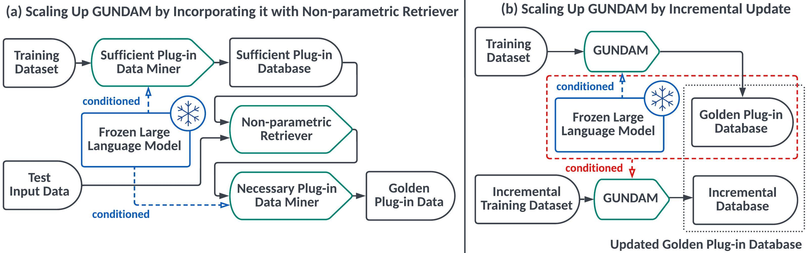

# Golden plUg-iN DAta Manager (GUNDAM)


<p align="center">
    <a href="https://jinjiarui.github.io/gundam/">Project</a> |
    <a href="https://jinjiarui.github.io/preprints/GUNDAM.pdf">Paper</a> |
    <a href="https://gundam-labet.readthedocs.io/en/latest/">Documentation</a>
</p>

**GUNDAM** is a data manager that utilizes language models to efficiently handle textual data, which is built upon [PyTorch](https://pytorch.org). 
GUNDAM is:

- **Comprehensive**: GUNDAM provides a data manager including our proposed miner, a GPT-2 based generator, and a demonstration retriever, and all of these components are extendable.
- **Flexible**: GUNDAM supports GPT-2 language models with different sizes.
- **Efficient**: GUNDAM provides an efficient one-to-one miner to check data quality.

--------------------------------------------------------------------------------

## Brief Introduction
GUNDAM is a novel data management framework that measures the sufficiency and necessity of plugging-in demonstrations conditioned on language models. 
We show that the proposed sufficiency and necessity metrics
can be operated on both demonstration instances (i.e., instance level) and demonstration sets (i.e., set level). 
Thus, the set of sufficient and necessary plug-in data, named as a golden plug-in set, can be regarded as a core set including the informative samples. 
Since enumerating and measuring all the possible subsets is infeasible, we design new tree-based search algorithms to mine the golden plug-in set.
Notice that the golden plug-in set could be pre-computed and stored to save online computation costs. 
In this regard, non-parametric demonstration retrievers could perform on the stored golden plug-in set instead of the whole data corpus, to avoid retrieving insufficient or unnecessary demonstrations. 
Moreover, considering that many real-world data corpus would keep growing, we develop an incremental update algorithm to avoid re-computing GUNDAM over all the changed and unchanged parts.



## Use Cases
The significant advantage of GUNDAM is that GUNDAM can be easily deployed on any existing data management platform because the core idea of GUNDAM is to assign different priority levels to the stored data to show their data qualities regarding the given language model.


## ToDo (Latest Update at 2023/07/24)
- [x] Release basic versions of a one-to-one miner and GPT-2 based generators in both unsupervised learning settings (a.k.a., few-shot inference) and supervised learning settings (a.k.a., warm-up inference).
- [x] Support random-based demonstration retrievers, relevance-based demonstration retrievers, and diversity-based demonstration retrievers. 
- [ ] Support pair-to-one miner and GPT-3 based generators.
- [ ] Release textual dataset of sufficiency and necessity.
- [ ] Release detailed document tutorial and readme guidance.


## Citing CORE
```bibtex
@software{GUNDAM,
  author = {Jiarui Jin, Yuwei Wu, Mengyue Yang, Xiaoting He, Weinan Zhang, Yiming Yang, Yong Yu, and Jun Wang},
  title = {GUNDAM: A Data-Centric Manager for Your Plug-in Data with Language Models},
  year = {2023},
  publisher = {GitHub},
  journal = {GitHub repository},
  version = {0.0},
  howpublished = {\url{https://github.com/GUNDAM-Labet/GUNDAM}},
}
```


## The Team
Core developers of the GUNDAM system are [Jiarui Jin](https://github.com/Jinjiarui), [Yuwei Wu](https://github.com/Willyoung2017) and [Mengyue Yang](https://github.com/ymy4323460).


## License
GUNDAM is released under the Apache License, Version 2.0.
